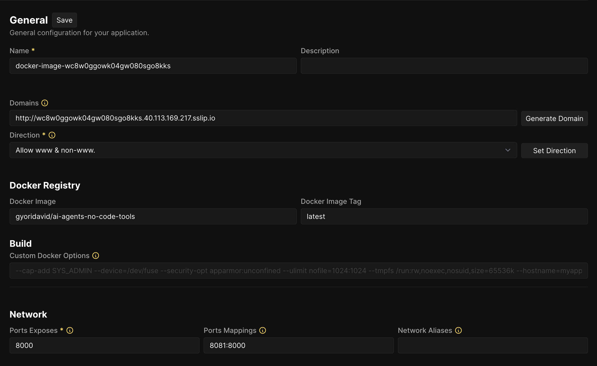

# How to start the server

## Requirements

- Docker (or Docker Desktop) installed on your machine
- at least 4vCPUs (cpu cores) and
  - to use chatterbox TTS, at least 8GB RAM
  - to use kokoro TTS, at least 6GB RAM

## Run the server locally

1. Open terminal on mac/linux, or Docker Desktop terminal (bottom-right corner) on Windows
2. Run the following command to start the server:

   ```bash
        docker run --rm -p 8000:8000 -it gyoridavid/ai-agents-no-code-tools:latest
   ```

3. If you have an NVidia GPU and have the Cuda Toolkit installed, you can run the server with GPU support:

   ```bash
        docker run --rm --gpus=all -e NVIDIA_VISIBLE_DEVICES=all -e NVIDIA_DRIVER_CAPABILITIES=all -p 8000:8000 -it gyoridavid/ai-agents-no-code-tools:latest-cuda
   ```

## Deploy the server to the cloud

We recommend using Coolify to deploy the server to the cloud. Use the Docker image `gyoridavid/ai-agents-no-code-tools:latest` to deploy the server, and map port `8000` to the host.



## How to figure out the server URL

|                                                      | n8n is running locally, using `n8n start`                                                       | n8n is running locally using Docker                                                                                                                                                                                                 | n8n is running in the cloud                                                                      |
| ---------------------------------------------------- | ----------------------------------------------------------------------------------------------- | ----------------------------------------------------------------------------------------------------------------------------------------------------------------------------------------------------------------------------------- | ------------------------------------------------------------------------------------------------ |
| `AI Agents No-Code Tools` running in Docker, locally | `http://localhost:8000`                                                                         | It depends. You can technically use `http://host.docker.internal:8000` as it points to the host, but you could configure to use the same network and use the service name to communicate like `http://ai-agents-no-code-tools:8000` | won’t work - deploy `AI Agents No-Code Tools` to the cloud                                       |
| `AI Agents No-Code Tools` is running in the cloud    | You should use your IP address `http://{YOUR_IP}:8000` or the domain you deployed the server to | You should use your IP address `http://{YOUR_IP}:8000`                                                                                                                                                                              | You should use your IP address `http://{YOUR_IP}:8000` or the domain you deployed the service to |
